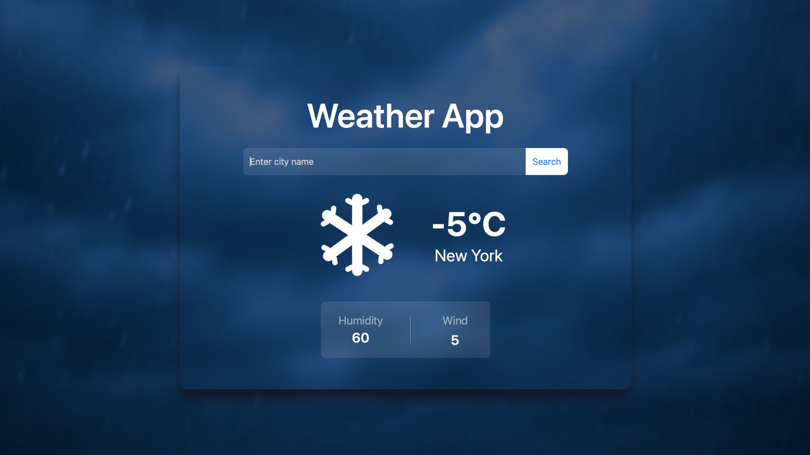

# Weather App

This project is a React application that allows users to get current weather information by entering a city name. The app supports both real-time API data and predefined static weather data for popular cities.



## Features

- Search weather by city name
- OpenWeatherMap API integration (fallback to static data if API key is missing)
- Predefined static data for major cities
- Responsive design using Tailwind CSS
- Smooth transitions and temperature display animations

## Installation

1. Clone the repository:
```
git clone https://github.com/Magicmouseee/weather-app-react.git
```
2. Navigate to the project directory:

```
cd weather-app-react
```
3. Install dependencies:
```
npm install
```
4. (Optional) Create a .env file and add your API key:
```
VITE_WEATHER_API_KEY=your_api_key_here
```
5. Start the development server:
```
npm run dev
```
## About This Project

I built this weather app to practice working with APIs and improve my frontend development skills using React.

